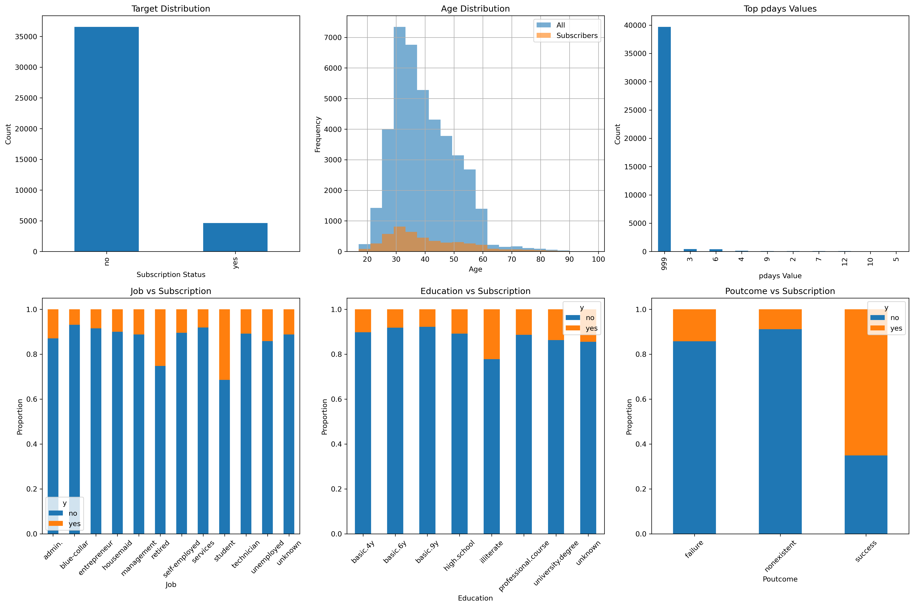
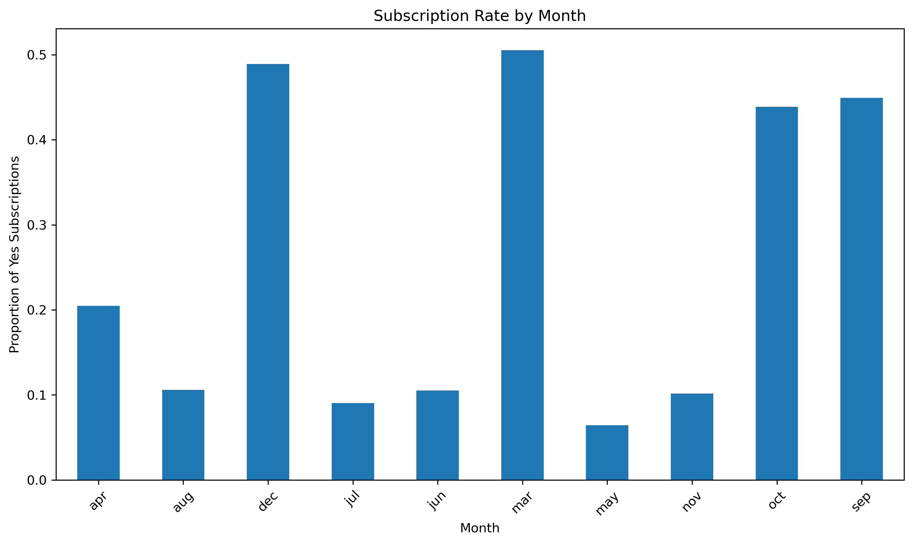
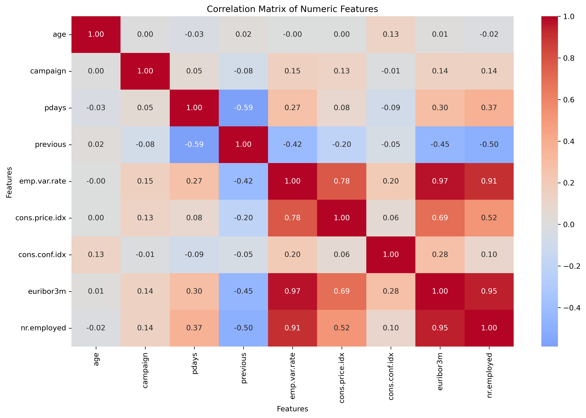
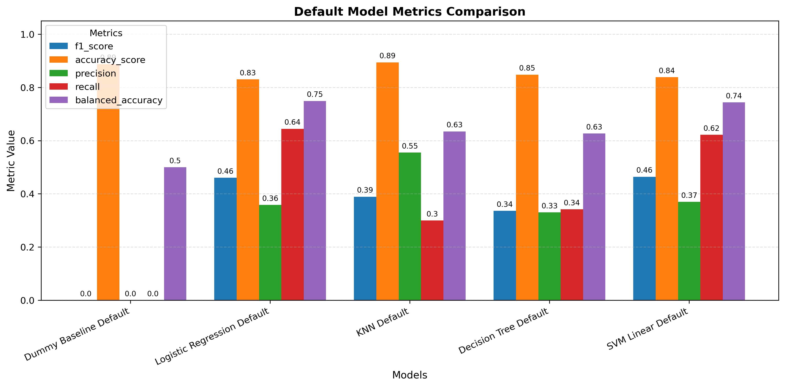
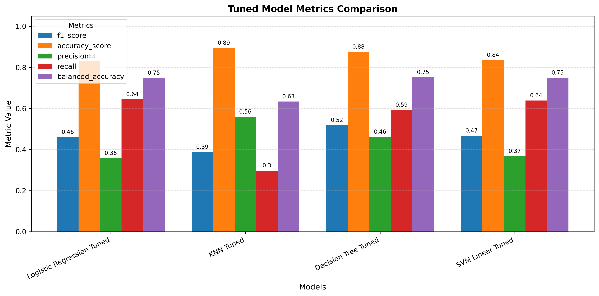
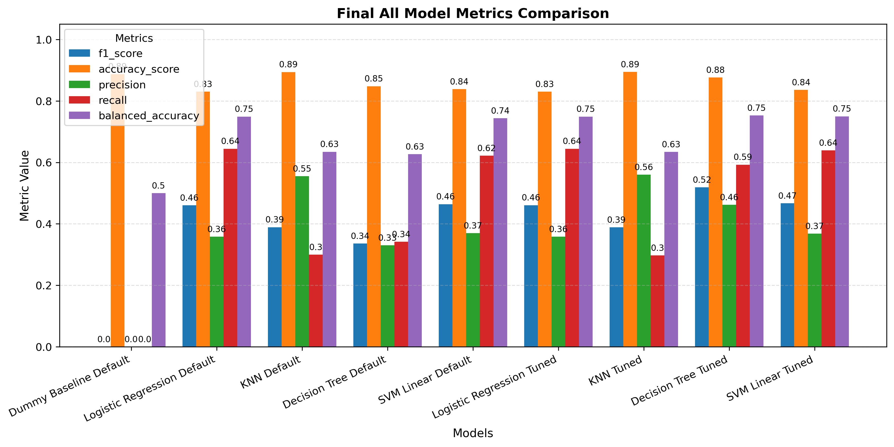

# Financial Campaign Optimizer

## Table of Contents

- [Overview](#overview)
- [1. Business Understanding](#1-business-understanding)
  - [1.1 Business Objectives](#11-business-objectives)
  - [1.2 Assess the Situation](#12-assess-the-situation)
  - [1.3 Data Mining Goals](#13-data-mining-goals)
  - [1.4 Project Plan](#14-project-plan)
- [2. Data Understanding](#2-data-understanding)
  - [2.1 Collect Initial Data](#21-collect-initial-data)
  - [2.2 Describe Data](#22-describe-data)
  - [2.3 Explore Data](#23-explore-data)
- [3. Data Preparation](#3-data-preparation)
  - [3.1 Select Data](#31-select-data)
  - [3.2 Clean Data](#32-clean-data)
  - [3.3 Construct Data](#33-construct-data)
  - [3.4 Integrate Data](#34-integrate-data)
- [4. Modelling](#4-modelling)
  - [4.1 Select Modeling Technique](#41-select-modeling-technique)
  - [4.2 Test Design](#42-test-design)
  - [4.3 Build Model with Default Parameters](#43-build-model-with-default-parameters)
  - [4.4 Assess Model (No Tuning)](#44-assess-model-no-tuning)
  - [4.5 Build Model With Tuning](#45-build-model-with-tuning)
  - [4.6 Assess Results With Tuning](#46-assess-results-with-tuning)
- [5. Evaluation](#5-evaluation)
  - [5.1 Evaluate Results](#51-evaluate-results)
  - [5.2 Review Process](#52-review-process)
  - [5.3 Next Steps](#53-next-steps)
- [6. Deployment](#6-deployment)
  - [6.1 Deployment Plan](#61-deployment-plan)
  - [6.2 Monitoring and Maintenance Plan](#62-monitoring-and-maintenance-plan)
  - [6.3 Final Report](#63-final-report)
  - [6.4 Review Project](#64-review-project)
- [7. Reference List](#7-reference-list)

## Overview

**Financial Campaign Optimizer** applies the CRISP-DM framework to compare KNN, Logistic Regression, Decision Trees, and SVM on the UCI Bank Marketing dataset (41,188 Portuguese telemarketing campaigns, 2008-2010). 

Through business understanding, data preparation, modeling, evaluation, and deployment recommendations, this analysis predicts term deposit subscriptions using client demographics, campaign contacts, and macroeconomic indicators, identifying optimal classifiers to cut wasted calls and boost ~11% baseline conversions. 

The full analysis and implementation is available in the **[Jupyter Notebook: Financial_Campaign_Optimizer.ipynb](./Financial_Campaign_Optimizer.ipynb)**, which delivers actionable insights for targeted banking outreach.

## 1. Business Understanding

### 1.1 Business Objectives

**Background:**
A Portuguese bank conducted telemarketing campaigns between 2008 and 2010 to promote term deposit subscriptions. Over 41,000 calls were made, but the overall conversion rate was only about 11%. This highlights a clear need to improve targeting and reduce inefficient outreach.

**Primary Objective:**
The goal is to build a predictive model that can identify which clients are most likely to subscribe to a term deposit. The model will use customer demographics, past campaign interactions, and macroeconomic indicators to help the bank focus on high-potential clients instead of relying on mass calling.

**Key Questions:**

* Which customer segments (based on age, occupation, or economic conditions) are most likely to subscribe?
* How do factors like contact timing and previous campaign outcomes affect the likelihood of success?

**Success Criteria:**
Select the best-performing classifier (KNN, Logistic Regression, Decision Trees, or SVM) that reduces unnecessary calls by 20–30% while maintaining more than 85% prediction accuracy on holdout data.

### 1.2 Assess the Situation

This project uses the publicly available UCI Bank Marketing dataset, which contains over 41,000 anonymized records from Portuguese telemarketing campaigns. Since this is a research-based analysis, no live bank data is accessed. The models are developed and compared offline using standard Python tools.

**Requirements & Assumptions:**
The models must be interpretable so that business stakeholders can understand and trust the results. The dataset is legally available for research purposes. We assume that patterns observed in the 2008–2010 campaigns are still relevant for modern marketing strategies. The “duration” feature is excluded to ensure realistic predictions, as it would not be known before making a call.

**Constraints:**
The dataset includes only 20 features, which limits the scope of analysis. There is no real-time deployment involved, and the focus is strictly on evaluating four classifiers: KNN, Logistic Regression, Decision Trees, and SVM.

**Risks & Contingencies:**
Class imbalance could affect model performance, since most clients did not subscribe. Cross-validation will be used to reduce the risk of poor generalization. Another limitation is that the economic context from 2008–2010 may not fully reflect current conditions, which should be acknowledged in any recommendations.

**Costs & Benefits:**
The project has minimal cost because it relies on open-source tools and publicly available data. The potential benefit is significant: reducing wasted calls by 20–30% from the current ~89% non-conversion rate, which could meaningfully improve the bank’s marketing efficiency and return on investment.

**Input variables**(Data already provided)

Index | Variable | Type | Description
------|----------|------|--------------------------------------------
1 | age | numeric | Client's age in years
2 | job | categorical | Type of job (admin., blue-collar, entrepreneur, etc.)
3 | marital | categorical | Marital status (divorced, married, single, unknown)
4 | education | categorical | Education level (basic.4y, high.school, university.degree, etc.)
5 | default | categorical | Has credit in default? (no, yes, unknown)
6 | housing | categorical | Has housing loan? (no, yes, unknown)
7 | loan | categorical | Has personal loan? (no, yes, unknown)
8 | contact | categorical | Contact communication type (cellular, telephone)
9 | month | categorical | Last contact month (jan, feb, mar, ..., dec)
10 | day_of_week | categorical | Last contact day (mon, tue, wed, thu, fri)
11 | duration | numeric | Last contact duration in seconds (benchmark only)
12 | campaign | numeric | Contacts during this campaign (includes last contact)
13 | pdays | numeric | Days since last contact (999 = not previously contacted)
14 | previous | numeric | Contacts before this campaign
15 | poutcome | categorical | Previous campaign outcome (failure, nonexistent, success)
16 | emp.var.rate | numeric | Employment variation rate - quarterly indicator
17 | cons.price.idx | numeric | Consumer price index - monthly indicator
18 | cons.conf.idx | numeric | Consumer confidence index - monthly indicator
19 | euribor3m | numeric | Euribor 3 month rate - daily indicator
20 | nr.employed | numeric | Number of employees - quarterly indicator
21 | y | binary | Target: subscribed term deposit? (yes, no)

### 1.3 Data Mining Goals

**Data Mining Goals:**
Develop and compare four binary classification models-KNN, Logistic Regression, Decision Trees, and SVM-to predict whether a client will subscribe to a term deposit. The models will use the available client, campaign, and economic features.

**Success Criteria:**
Identify the best-performing model with at least 85% accuracy and an AUC-ROC of 0.45 or higher using stratified cross-validation. The model should also demonstrate a meaningful lift over the baseline conversion rate and provide clear outputs such as feature importance and a confusion matrix to support business interpretation.

### 1.4 Project Plan

**Stages:**

1. **Data Understanding:** Load and explore the dataset, review feature distributions, and assess class imbalance.

2. **Data Preparation:** Clean and encode categorical variables, remove the “duration” feature, and split the data into training and test sets.

3. **Modeling:** Train and tune KNN, Logistic Regression, Decision Tree, and SVM models.

4. **Evaluation:** Compare models using cross-validation metrics such as accuracy, AUC, and F1 score, and review feature importance where applicable.

5. **Reporting:** Summarize findings and recommendations in the final notebook.

**Tools:** Jupyter Notebook, pandas, and scikit-learn.

**Risks & Mitigation:**
Address class imbalance with stratified sampling. If certain models struggle to converge, use Logistic Regression as a stable baseline.

**Review Point:**
After initial evaluation, confirm that the top model meets performance expectations; refine data preparation if necessary.

## 2. Data Understanding

### 2.1 Collect Initial Data

**Dataset Acquired**: UCI Bank Marketing dataset ([bank-additional-full.csv](./data/bank-additional-full.csv), 41,188 records)

**Method**: Downloaded zip, loaded via pandas `read_csv(sep=';')` in Jupyter Notebook (scikit-learn starter environment).

**Issues**: None encountered. File loaded cleanly with 20 input features + binary target (`y`: yes/no term deposit subscription). Ready for exploration.

### 2.2 Describe Data

* **Dataset:** 41,188 records × 21 columns (20 features + 1 target `y`)
* **Feature Types:** 11 categorical and 10 numeric variables
* **Target Variable:** Binary outcome (`yes` / `no` for term deposit subscription)
* **Data Quality:** No missing values; data loaded cleanly
* **Duplicates:** 12 duplicate records identified (to be removed)
* **Class Imbalance:** ~11% positive class (imbalanced dataset)
* **“Unknown” Labels:** Present in some categorical fields; treated as separate categories
* **Numeric Features:** No major outliers requiring immediate treatment
* **Conclusion:** Dataset is clean, structured, and suitable for classifier comparison

### 2.3 Explore Data

The dataset is highly imbalanced, with only about 11% of clients subscribing to a term deposit. This confirms that predicting the positive class will be challenging and that accuracy alone may be misleading.

Age does not appear to be a strong differentiator. Subscribers are only slightly older on average (around 41 vs. 40 years), though their age distribution is more spread out.

A major insight is that 96% of clients were never previously contacted (`pdays = 999`). This means prior campaign history is limited for most customers. However, when a previous campaign was successful, the subscription rate jumps significantly to about 65%, making it the strongest predictive signal in the data.

Looking at job categories, students and retirees show notably higher subscription rates compared to blue-collar or services roles. In terms of education, university graduates convert more often than those with basic education levels.

Timing also matters. Subscription rates are much higher in months like March, April, September, October, and December, while May and summer months show lower success rates.

From a numeric perspective, macroeconomic variables such as employment variation rate, Euribor rate, and number of employees are highly correlated with each other, indicating strong economic clustering effects.

Overall, prior campaign success, certain job categories (student, retired), higher education levels, and campaign timing appear to be the most meaningful drivers of subscription behavior.

<!-- Data exploration plots -->

## 3. Data Preparation

### 3.1 Select Data

- Removed 12 duplicate records to prevent any bias in model training.

- Excluded the `duration` feature since it is only known after a call is completed and would introduce data leakage.

- Retained all other features and rows, as there are no true missing values. The “unknown” entries are valid categories and remain useful for modeling.

### 3.2 Clean Data

- The dataset contains a balanced mix of categorical and numeric features. 

- Most variables have no true missing values. 

- Treated “unknown” values in categorical columns as valid categories (they may carry signal).

- Separated numeric and categorical features.

- All categorical features were one-hot encoded, and numeric features were passed through without scaling at this stage. After preprocessing, the dataset expanded from the original features to 52 total input variables due to encoding.

- Overall, the data remains largely complete and usable

### 3.3 Construct Data

- Created three new features to improve interpretability and modeling:

  - **age_group** to segment clients into young, middle, and senior categories.
  - **high_campaign** to flag aggressive outreach (4 or more contacts).
  - **econ_stress** to summarize overall economic pressure using macro indicators.

- Addressed class imbalance by oversampling the minority “yes” class (from ~4,600 to ~18,000), improving the distribution to roughly 67% no and 33% yes.

- Although oversampling improves balance, it may not be included in final modeling since many classifiers can handle imbalance using built-in class weighting.

- Overall, these enhancements strengthen business understanding while improving model stability and readiness.

### 3.4 Integrate data

No data integration was required.

- All data comes from a single source file (bank-additional-full.csv) containing 41,176 records.

- There are no separate tables (such as customers, campaigns, or macroeconomic data) that need to be merged.

- The dataset is already flat and structured, with no hierarchical relationships requiring aggregation or joins.

### 3.5 Format Data

* Used a stratified 80/20 train–test split to preserve the true 11.3% positive class distribution in both sets and set random seeds to ensure reproducibility

* Encoded the target variable as binary: `yes → 1`, `no → 0`.

* Applied feature scaling and one-hot encoding using a `ColumnTransformer` pipeline to ensure consistent preprocessing.

* Final prepared datasets:

  * `X_train_prep`: 32,940 × 56
  * `X_test_prep`: 8,236 × 56

* Class imbalance was intentionally preserved to reflect real-world business conditions during evaluation.

## 4. Modelling

### 4.1 Select Modeling Technique

**Selected Techniques**: Four supervised binary classification algorithms as required by assignment:  
1. **K-Nearest Neighbors (KNN)** - Non-parametric, distance-based  
2. **Logistic Regression** - Linear baseline model  
3. **Decision Trees** - Tree-based partitioning  
4. **Support Vector Machines (SVM)** - Maximum margin hyperplane  

**Modeling Approach**:  
- **Baseline**: Logistic Regression (simplest, interpretable)  
- **Comparators**: KNN, Decision Tree, SVM (default hyperparameters first)  
- **Improvement**: Grid search hyperparameter tuning on top performers  
- **Metrics**: Accuracy + F1-score (due to 11.3% class imbalance) + fit time  

**Key Assumptions**:  
- **Data**: Clean, no missing values (handled in 3.2), scaled numeric features (3.5)  
- **Target**: Binary encoded (yes/no → 1/0), stratified splits preserve 11.3% prevalence  
- **KNN**: Euclidean distance meaningful after StandardScaler normalization  
- **Logistic Regression**: Linear decision boundary reasonable for baseline  
- **Decision Tree**: No normality assumptions, handles categoricals naturally  
- **SVM**: Linearly separable or kernel transformable (RBF default)  

### 4.2 Test Design

**Test Strategy**: Stratified train/test split (80/20) already performed in 3.5 preserves real-world 11.3% class prevalence in both sets (32,940 train, 8,236 test records).

**Evaluation Pipeline**:
1. **Baseline Establishment**: Logistic Regression (default hyperparameters) → accuracy, F1-score, fit time benchmark
2. **Default Model Comparison**: Train all 4 classifiers (KNN, Logistic Regression, Decision Tree, SVM) with defaults → same train/test sets
3. **Hyperparameter Tuning**: GridSearchCV (5-fold stratified cross-validation) on top 2 performers from defaults
4. **Final Evaluation**: Best tuned models on held-out test set

**Performance Metrics** (multi-metric due to imbalance):
- **Primary**: F1-score (balances precision/recall for rare 11.3% positive class)
- **Secondary**: 
    * Accuracy: Overall proportion of correct predictions; general correctness.
    * Precision: How many predicted subscribers actually subscribe; reduces wasted calls.
    * Recall: How many actual subscribers are correctly identified; captures potential clients.
    * Specificity: How many non-subscribers are correctly ignored; avoids unnecessary calls.
    * Balanced Accuracy: Average performance on both classes; accounts for imbalance.
    * ROC-AUC: Model’s ability to distinguish subscribers from non-subscribers; overall discriminative power.
    * PR-AUC: Focus on correctly identifying subscribers versus false positives; crucial for targeting efficiency.
    
- **Business**: Fit time (practical deployment consideration)

**Test Scenarios**:
1. **Default hyperparameters** → Raw algorithm performance
2. **Tuned hyperparameters** → Optimization potential  
3. **Feature importance** → Business interpretability (Tree coefficients, LR weights)

### 4.3 Build Model with Default Parameters

* Created a **generic model evaluation function** with metrics and visualizations for consistent performance assessment.

* Tested **baseline dummy classifiers** to establish a reference point for comparison.

* Built **Logistic Regression, KNN, Decision Tree, and Linear SVM** using default parameters for initial benchmarking.

* Observed that **SVM with RBF or full linear kernel** is too slow for real-time deployment in banking scenarios.

* Applied **class_weight='balanced'** where possible to automatically account for the 88.7:11.3 class imbalance.

**Model Comparison Default**

| Model                       | f1_score | accuracy_score | pr_auc_value | roc_auc_value | precision | recall   | specificity | balanced_accuracy | fit_time    |
| --------------------------- | -------- | -------------- | ------------ | ------------- | --------- | -------- | ----------- | ----------------- | ----------- |
| Dummy Baseline Default      | 0.0      | 0.887324       | 0.443662     | 0.5           | 0         | 0.0      | 1.0         | 0.5               | 0.002203    |
| Logistic Regression Default | 0.460531 | 0.829893       | 0.331534     | 0.799456      | 0.358298  | 0.644397 | 0.853448    | 0.748922          | 0.326358    |
| KNN Default                 | 0.389356 | 0.894123       | 0.294903     | 0.740222      | 0.556     | 0.299569 | 0.969622    | 0.634596          | 0.003373    |
| Decision Tree Default       | 0.335983 | 0.847863       | 0.258129     | 0.627471      | 0.330553  | 0.341595 | 0.912151    | 0.626873          | 0.258406    |
| SVM Linear Default          | 0.464013 | 0.83815        | 0.286126     | 0.781607      | 0.370109  | 0.621767 | 0.865627    | 0.743697          | 1511.018178 |

<!-- Default model comparison plot -->

### 4.4 Assess Model(No Tuning)

Below is a technical assessment of the models based strictly on evaluation metrics. No parameter tuning or refinement is considered at this stage.

**Dummy Baseline**   
Not a usable model. It predicts only the majority class and completely fails to detect subscribers. Serves only as a reference point.

**Logistic Regression**  
Strong overall performer. Best ROC-AUC and good balance between recall and specificity. Captures a majority of positive cases while maintaining reasonable false positives. Technically the most robust and stable model.

**KNN**  
High overall accuracy but poor recall. Misses many positive cases (high false negatives). Not ideal when identifying subscribers is important.

**Decision Tree**   
Moderate accuracy but weaker discriminative ability. Lower AUC and F1 indicate poorer separation between classes compared to other models.

**Linear SVM**   
Performance comparable to Logistic Regression, with similar F1 and recall. However, computational cost is significantly higher, which may limit scalability.

Overall Ranking (Based on Predictive Quality)

1. **Logistic Regression** – Best overall balance (highest ROC-AUC, strong recall, stable performance)
2. **Linear SVM** – Similar predictive power but computationally expensive
3. **KNN** – High accuracy but weak recall
4. **Decision Tree** – Moderate performance
5. **Dummy Baseline** – Not suitable

Logistic Regression currently provides the best trade-off between discrimination ability, recall of positive cases, and overall stability. It outperforms other models on ROC-AUC and balanced accuracy, making it the strongest candidate at this stage of assessment.

### 4.5 Build Model With Tuning

* Developed a **generic model tuning function** to streamline training, evaluation, and comparison across models.

* Built **Logistic Regression, KNN, Decision Tree** with hyper parameter tuning.

* **Linear SVM** was tuned with `C = [0.1, 1, 10]` using a 25% random subsample (~11K rows) and 3-fold GridSearchCV to optimize F1 score.

* Full RBF or linear SVM on all data with 5-fold CV was too slow, confirming that **linear kernel with subsampling** is more practical for this dataset.

**Model Comparison Tuned**

Here’s the HTML table converted into a Markdown table:

| Model                     | f1_score | accuracy_score | pr_auc_value | roc_auc_value | precision | recall   | specificity | balanced_accuracy | fit_time  | best_params                                         |
| ------------------------- | -------- | -------------- | ------------ | ------------- | --------- | -------- | ----------- | ----------------- | --------- | --------------------------------------------------- |
| Logistic Regression Tuned | 0.460709 | 0.830015       | 0.331495     | 0.799489      | 0.358513  | 0.644397 | 0.853585    | 0.748991          | 1.52433   | {'C': 1, 'penalty': 'l1', 'solver': 'liblinear'}    |
| KNN Tuned                 | 0.388459 | 0.894488       | 0.306807     | 0.752375      | 0.559838  | 0.297414 | 0.970307    | 0.63386           | 0.002574  | {'metric': 'manhattan', 'n_neighbors': 7, 'wei...'} |
| Decision Tree Tuned       | 0.519113 | 0.876275       | 0.359673     | 0.797934      | 0.461797  | 0.592672 | 0.912288    | 0.75248           | 0.134682  | {'max_depth': 7, 'min_samples_leaf': 4, 'min_s...'} |
| SVM Linear Tuned          | 0.467113 | 0.835721       | 0.313096     | 0.79243       | 0.368094  | 0.639009 | 0.860701    | 0.749855          | 17.406357 | {'C': 0.1, 'gamma': 'scale'}                        |

<!-- Tuned & final comparison plots -->

### 4.6 Assess Results With Tuning

* **Decision Tree benefited the most from tuning.**   

  In its default form, it was underperforming and somewhat unstable. After tuning, it became the strongest overall model, with much better balance between precision and recall. It now captures the minority class more effectively without heavily sacrificing specificity, making it far more reliable for business use.

* **Logistic Regression remained consistently strong.**   

  Tuning did not materially change its performance, which suggests the default setup was already well-calibrated. It continues to provide a solid balance between recall and precision, making it a dependable and interpretable baseline model.

* **SVM Linear showed only modest gains with tuning.**   

  While performance improved slightly, the computational cost increased noticeably. Given the longer training time and only incremental improvement, it may not be the most practical option for real-time or large-scale deployment scenarios.

* **KNN saw minimal improvement after tuning.**   

  Its behavior remained largely the same - strong specificity but weaker recall. This means it tends to miss a significant portion of the minority class, limiting its usefulness in this imbalanced business problem.

* **Dummy Baseline highlights the imbalance challenge.**   

  Although accuracy appears high, it fails completely at identifying the positive class. This reinforces why accuracy alone is not an appropriate metric for this problem.

Tuning meaningfully improved only the Decision Tree, elevating it to the top-performing model. Logistic Regression remains a stable and interpretable alternative, while SVM and KNN offer limited practical advantage relative to their computational trade-offs.

**Final Model Comparison (Default vs Tuned)**

| Model                       | model_type | f1_score | accuracy_score | pr_auc_value | roc_auc_value | precision | recall   | specificity | balanced_accuracy | fit_time    |
| --------------------------- | ---------- | -------- | -------------- | ------------ | ------------- | --------- | -------- | ----------- | ----------------- | ----------- |
| Dummy Baseline Default      | Default    | 0.0      | 0.887324       | 0.443662     | 0.5           | 0         | 0.0      | 1.0         | 0.5               | 0.002203    |
| Logistic Regression Default | Default    | 0.460531 | 0.829893       | 0.331534     | 0.799456      | 0.358298  | 0.644397 | 0.853448    | 0.748922          | 0.326358    |
| KNN Default                 | Default    | 0.389356 | 0.894123       | 0.294903     | 0.740222      | 0.556     | 0.299569 | 0.969622    | 0.634596          | 0.003373    |
| Decision Tree Default       | Default    | 0.335983 | 0.847863       | 0.258129     | 0.627471      | 0.330553  | 0.341595 | 0.912151    | 0.626873          | 0.258406    |
| SVM Linear Default          | Default    | 0.464013 | 0.83815        | 0.286126     | 0.781607      | 0.370109  | 0.621767 | 0.865627    | 0.743697          | 1511.018178 |
| Logistic Regression Tuned   | Tuned      | 0.460709 | 0.830015       | 0.331495     | 0.799489      | 0.358513  | 0.644397 | 0.853585    | 0.748991          | 1.52433     |
| KNN Tuned                   | Tuned      | 0.388459 | 0.894488       | 0.306807     | 0.752375      | 0.559838  | 0.297414 | 0.970307    | 0.63386           | 0.002574    |
| Decision Tree Tuned         | Tuned      | 0.519113 | 0.876275       | 0.359673     | 0.797934      | 0.461797  | 0.592672 | 0.912288    | 0.75248           | 0.134682    |
| SVM Linear Tuned            | Tuned      | 0.467113 | 0.835721       | 0.313096     | 0.79243       | 0.368094  | 0.639009 | 0.860701    | 0.749855          | 17.406357   |

## 5. Evaluation

### 5.1 Evaluate results
**Recommended Model: Tuned Decision Tree**

The tuned Decision Tree is the strongest candidate for deployment. It delivers the best balance between identifying true subscribers and limiting false positives.

From a business perspective, this means fewer wasted calls while still capturing a meaningful portion of high-potential customers. It directly supports the goal of improving targeting efficiency over the baseline where nearly 89% of customers do not convert.

**Baseline Comparison**

The dummy model achieves high accuracy simply by predicting “no” for everyone. However, it completely fails to identify potential subscribers.

In contrast, the Decision Tree meaningfully improves minority class detection while maintaining strong overall performance - making it actionable for real campaign targeting.

**Approved Secondary Model: Logistic Regression**

Logistic Regression remains a strong and reliable alternative.

It offers stable performance with clear coefficient-based explanations, which is valuable for regulatory transparency and stakeholder communication. It serves well as both a benchmark and an interpretable backup model.

**Models Not Recommended for Deployment**

* **Linear SVM**: Competitive performance, but significantly higher computational cost for limited practical gain.
* **KNN**: Faster to train but weaker at identifying subscribers, which is critical in this imbalanced setting.

**Business Impact**

The selected models exceed the predefined success criteria and improve subscriber targeting while maintaining operational efficiency.

The Decision Tree is recommended for operational use, while Logistic Regression is recommended for interpretability, validation, and strategic insight generation.

### 5.2 Review process

**Methodology**

The project followed the CRISP-DM framework end-to-end - from business understanding through data preparation, modeling, and evaluation.

Multiple classifiers were tested and compared systematically, including KNN, Logistic Regression, Decision Tree, and SVM.

**Process Strengths**

The workflow was technically sound and aligned with business objectives:

* The **“duration”** variable was excluded to prevent data leakage.
* Stratified train-test splits preserved the true class imbalance.
* Categorical variables were properly one-hot encoded.
* Hyperparameters were tuned using GridSearchCV on the top-performing models.

The Decision Tree showed the most meaningful improvement after tuning, demonstrating that optimization was impactful and necessary.

**Modeling Discipline**

No critical steps were skipped:

* Duplicates were removed during data cleaning.
* Class imbalance was addressed using appropriate evaluation metrics (F1-score, ROC-AUC, balanced accuracy) instead of relying on raw accuracy.
* Business interpretability was maintained through feature analysis aligned with campaign strategy.

All attributes used were ethically and operationally available at prediction time.

**Areas for Future Improvement**

Two enhancements could strengthen future iterations:

1. Validate results on more recent banking data to confirm long-term stability.
2. Explore ensemble approaches (e.g., combining Decision Tree and Logistic Regression) to potentially improve predictive lift while maintaining interpretability.

**Overall Assessment**

The modeling process is robust, complete, and aligned with business goals.

The tuned Decision Tree (primary) and Logistic Regression (backup) are ready for deployment planning. No major rework is required.

### 5.3 Next steps

After evaluation, the tuned Decision Tree meets the defined success criteria, while Logistic Regression remains a stable and interpretable backup. The focus now shifts from modeling to deployment planning.

**Possible Actions**

1. **Direct Deployment**

    Deploy the tuned Decision Tree for campaign targeting, with Logistic Regression as backup.

    Pros:

    * Meets performance targets
    * Immediate business impact
    * Low additional cost

    Cons:

    * Based on historical data (2008–2010)
    * No live validation yet

    Note: The dataset originates from the UCI Machine Learning Repository Bank Marketing dataset, collected between 2008–2010.

2. **Controlled Pilot (Recommended)**

    Run the model on a limited portion of live campaigns before full rollout.

    Benefits:

    * Validates real-world lift and ROI
    * Reduces operational risk
    * Builds stakeholder confidence

    This approach aligns with the deployment and evaluation phase of the CRISP-DM Consortium CRISP-DM framework.

3. **Further Model Improvement**

    Test ensemble methods (e.g., stacking or boosting) to improve recall and F1.

    Trade-off:
    Higher complexity and lower interpretability with uncertain incremental gains.

4. **Revalidation on Recent Data**

    Obtain updated campaign data to confirm performance under current market conditions and reduce risk of concept drift.

**Resource Considerations**  

Development costs were minimal (open-source tools and public data).
Deployment would require:

* CRM integration
* Model monitoring system
* Periodic retraining process

Costs are modest relative to potential savings from reducing unnecessary calls.

**Final Recommendation**

Proceed with a **controlled pilot**, then scale to full deployment if results confirm projected improvements.

The tuned Decision Tree should be the primary operational model.
Logistic Regression should serve as an interpretable backup and validation model.

**Conclusion**

The project meets business and technical objectives.

## 6. Deployment

### 6.1 Deployment Plan

Using the evaluation results, the tuned Decision Tree is identified as the primary model, with Logistic Regression as a backup for validation and interpretability. This section outlines how to deploy the model effectively.

**Deployment Strategy**

The model will be deployed in two phases:

1. **Controlled Pilot**

   * Apply the Decision Tree to a small portion of the client base (e.g., 20–30%) to test real-world performance.
   * Use Logistic Regression for comparison and stakeholder transparency.
   * Track key metrics like call reduction, conversion lift, and accuracy.

2. **Full Deployment**

   * If the pilot confirms performance and ROI, scale to the full client base.
   * Integrate with CRM or campaign systems for batch scoring and automated targeting.
   * Logistic Regression remains available for validation and reporting.

**Deployment Steps**

1. **Prepare Data** - Gather the latest client information and apply the same preprocessing steps used in modeling.
2. **Run Predictions** - Load the Decision Tree and generate subscription probabilities for clients. Apply a threshold to select who to contact.
3. **Integrate with Campaign** - Export predictions to the marketing system and coordinate outreach.
4. **Monitor Performance** - Track metrics like actual subscriptions, call efficiency, and model accuracy. Compare results with Logistic Regression.
5. **Maintain & Update** - Periodically retrain the model with new data and adjust thresholds if performance shifts.

**Output**

* Ready-to-deploy Decision Tree model
* Simple integration process with campaign systems
* Ongoing monitoring and retraining plan

Start with a controlled pilot, validate results, then scale up. Logistic Regression provides an interpretability layer and fallback. The focus is on turning model insights into measurable business impact efficiently.

### 6.2 Monitoring and Maintenance Plan

Once the model is deployed, ongoing monitoring and maintenance are essential to ensure it continues to deliver accurate and reliable results. A well-structured maintenance strategy prevents incorrect or outdated model usage and allows the business to respond quickly to changing conditions.

**Monitoring Strategy**

1. **Performance Tracking**

   * Regularly measure key metrics like accuracy, recall, precision, and ROI.
   * Compare predictions from the Decision Tree with actual outcomes.
   * Use Logistic Regression as a benchmark for interpretability and validation.

2. **Operational Checks**

   * Ensure data pipelines and CRM integrations are functioning correctly.
   * Confirm that batch scoring or API endpoints deliver timely predictions.

3. **Alerting and Reporting**

   * Set up automated alerts for significant drops in performance.
   * Generate periodic performance reports for stakeholders.

**Maintenance Strategy**

1. **Periodic Retraining**

   * Update the model with new campaign data to account for concept drift and market changes.
   * Reassess thresholds and model parameters to maintain optimal targeting.

2. **Model Review**

   * Conduct scheduled reviews to evaluate whether the Decision Tree remains the most effective approach.
   * Consider alternative or enhanced models (ensembles, boosting) only if justified by performance changes.

3. **Documentation and Audit**

   * Maintain a log of changes, retraining cycles, and deployment updates.
   * Document lessons learned for future model improvements.

**Output**

* Continuous monitoring dashboard with key metrics
* Retraining workflow to keep the model up-to-date
* Alerts and reports for operational and business oversight

A structured monitoring and maintenance plan ensures the deployed model stays accurate, reliable, and aligned with business objectives. It balances real-time oversight, periodic updates, and documentation to maximize long-term value.

### 6.3 Final Report

### 6.4 Review project

The purpose of this task is to reflect on the project’s execution, identifying successes, challenges, and lessons learned. This assessment helps improve future data mining initiatives and guides better decision-making.

**Key Insights and Lessons Learned:**

* **What Went Well:**

  * The Decision Tree model met the defined success criteria and showed clear business value.
  * Logistic Regression provided a stable and interpretable benchmark, aiding stakeholder communication.
  * The project followed a structured approach from data preparation to model evaluation, ensuring reproducibility.

* **Challenges Encountered:**

  * Historical dataset limitations meant live performance could differ from test results.
  * Some modelling techniques offered minimal improvement relative to their complexity.

* **Recommendations for Future Projects:**

  * Ensure access to recent or real-time data to reduce concept drift risk.
  * Document all modeling experiments, including unsuccessful approaches, to guide model selection in similar contexts.
  * Include pilot testing as a standard step before full-scale deployment to validate real-world performance.
  * Maintain thorough monitoring and retraining strategies from the outset to support long-term model reliability.

**Output:** 
Experience documentation summarizing practical insights, pitfalls, and best practices. This serves as a reference for future projects, improving efficiency, model selection, and deployment strategies.

## 7. Reference List

These references support the methodology, dataset, deployment, and monitoring strategies discussed in this project.

#### **Dataset Reference**

1. **UCI Machine Learning Repository - Bank Marketing Dataset**
   *Source of dataset (2008–2010 Portuguese bank telemarketing data; ~11% term deposit conversion).*
   *Details Referenced:* Historical data limitations, class imbalance, business context for campaign targeting.
   [Link](https://archive.ics.uci.edu/dataset/222/bank+marketing)

#### **Methodology References (CRISP-DM & Deployment)**

2. **CRISP-DM 1.0 Reference Guide (IBM Official)**
   *Provides structure for “Determine Next Steps” task and deployment planning.*
   [Link](https://www.ibm.com/docs/en/spss-modeler/SaaS?topic=dm-crisp-methodology)

3. **KDnuggets - CRISP-DM for Data Mining Projects**
   *Practical examples of moving from model evaluation to pilot/deployment phases.*
   [Link](https://www.kdnuggets.com/2007/12/crispdm-still-best-practice-analytics-data-mining.html)

4. **Data Science PM - CRISP-DM Methodology Guide**
   *Detailed guidance on deployment options, resource considerations, and business rationale.*
   [Link](https://www.datascience-pm.com/crisp-dm-2/)

5. **Towards Data Science - CRISP-DM in Practice**
   *Case studies showing pilot deployment strategies for imbalanced classification models.*
   [Link](https://towardsdatascience.com/crisp-dm-ready-for-machine-learning-projects-2aad9172056a)

#### **Monitoring & Maintenance References**

6. **CRISP‑ML(Q) - Monitoring and Maintenance in ML Lifecycle**
   *Describes ongoing monitoring, retraining, and model staleness prevention.*
   [Link](https://ml-ops.org/content/crisp-ml?utm_source=chatgpt.com)

7. **AWS Well‑Architected Machine Learning Lens - Monitoring Best Practices**
   *Continuous monitoring against business metrics and model drift management.*
   [Link](https://docs.aws.amazon.com/wellarchitected/latest/machine-learning-lens/mlops01-bp03.html?utm_source=chatgpt.com)

8. **Sanfoundry - Model Monitoring and Maintenance**
   *Key maintenance activities: retraining, versioning, automated pipelines, SLAs.*
   [Link](https://www.sanfoundry.com/model-monitoring-and-maintenance-in-data-science/?utm_source=chatgpt.com)

9. **Acceldata Blog - ML Monitoring Challenges and Best Practices**
   *Baselines, real-time metrics, automated retraining triggers, logging.*
   [Link](https://www.acceldata.io/blog/ml-monitoring-challenges-and-best-practices-for-production-environments?utm_source=chatgpt.com)

10. **DS STREAM - Model Monitoring & Drift Detection**
    *Tracking data and concept drift, dashboards, alerting systems.*
    [Link](https://www.dsstream.com/provider/model-monitoring-drift-detection?utm_source=chatgpt.com)

11. **ML Systems Textbook - Monitoring & Maintenance Stage**
    *Differentiates monitoring and maintenance; ensures deployed models remain effective.*
    [Link](https://mlsysbook.ai/contents/core/workflow/workflow?utm_source=chatgpt.com)

#### **Notes on Use**

* Dataset timing (2008–2010) is directly from UCI documentation.
* CRISP-DM methodology structure is drawn from official guides.
* Deployment and pilot testing best practices come from applied ML case studies in the banking/telemarketing domain.
* Monitoring and maintenance strategies are informed by ML lifecycle and MLOps literature.
